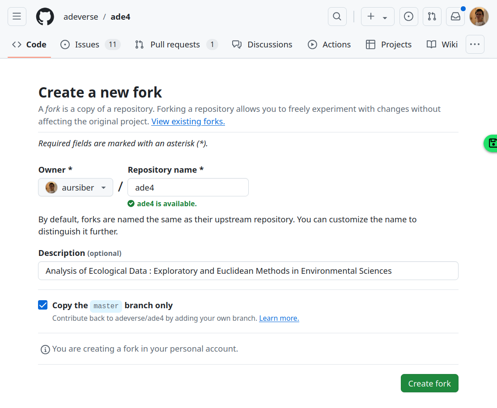
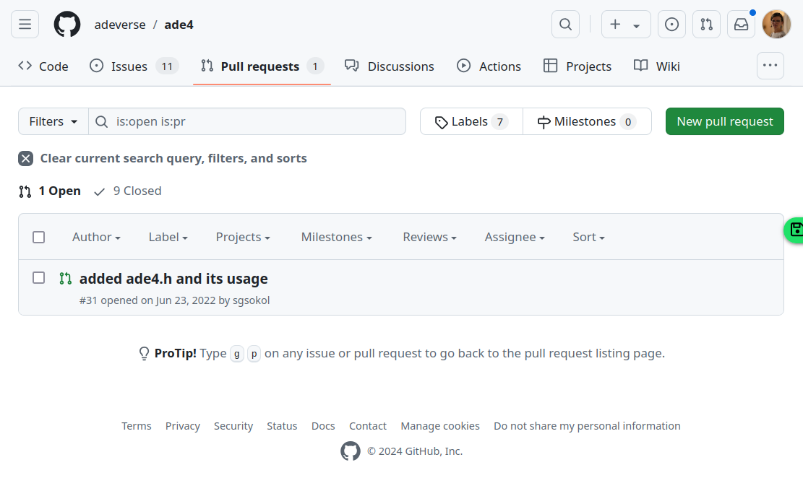
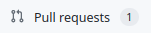

## C'est quoi GitHub ?

 

- Service web
- Interface conviviale intégrant les fonctionnalités `git`
- Hébergement gratuit de codes publics versionnés avec `git` 
- Accès illimité en nombre de projets et de collaborateur·trice·s

- Société à but lucratif
- Lancé en 2008
- Détenu par Microsoft depuis 2018
- [100 millions d'utilisateur·trice·s en 2023](https://github.blog/2023-01-25-100-million-developers-and-counting/)

 

.center[

]

---

## Interface pour `git` : page projet 

.center[

]

- Arboresence du projet `git`
- Page d'accueil `README.md`
- Liens et informations globales

---

## Interface pour `git` : fork

.center[

]

- Bouton  en haut à droite de la page GitHub du projet
- Copie du projet dans sa liste des projets GitHub
- Les modifications que vous apportez n'existent que sur votre copie du projet et n'affectent donc pas le projet d'origine.

---

## Interface pour `git` : pull request

.center[

&nbsp;

]

- Bouton  dans l'onglet  du projet.
- Soumission d'une modification que vous jugez satisfaisante et pertinente.
- Sur un projet que vous avez forké, sur lequel vous n'avez pas les droits.

---

## Interface pour `git` : merge

.pull-leftt[
.center[]
]
.pull-rightt[
- Les propriétaires du projet peuvent décider d'intégrer la modification soumise via le pull request.
- L'interface GitHub propose une gestion des conflits de code.

&nbsp;

]

---

## Un réseau social pour les dévelopeur·se·s

.pull-leftt2[
- Tout le monde peut se créer un compte
- Suivre des personnes (Follow) et des projets (Watch, Star)
- Créer un  ou une page web liée à votre projet
- Bénéficier ou de proposer de l'aide sur des codes publics ()
- Commenter des commits
- Grande visibilité
- Très grande communauté
]
.pull-rightt2[
.center[]
.center[]
]

---

## Intégration continue avec GitHub Actions

.center[

&nbsp;

]

- Création d'un workflow dans l'onglet 
- Fichier de configuration écrit en yaml
- Variables environnementales pour définir l'OS, les versions, les librairies des machines déployées
- Exécuté à chaque nouveau commit ou pull request
- Utile pour checker les packages sur plusieurs OS et avec plusieurs versions de R

---

## Alternatives

&nbsp;

&nbsp;

&nbsp;

&nbsp;

--

&nbsp;

GitLab : 
- L'alternative à GitHub la plus répandue
- Existe depuis 2011
- Entièrement **libre** (contrairement à GitHub)
- Possibilité d'avoir une installation GitLab auto-hébergée sur un serveur privé (voir [instance](https://doc.cc.in2p3.fr/fr/Collaborative-tools/tools/gitlab.html) académique disponible au centre de calcul de l'IN2P3 à Lyon ; chez GitHub, uniquement accessible avec un plan d'entreprise payant)

