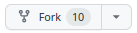
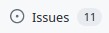
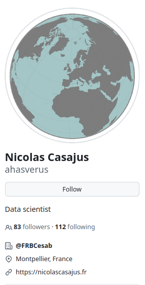

## C'est quoi GitHub ?

 

- Service web avec une interface simplifiée pour `git`
- Outils intégrés : gestion de projet, suivi des tâches, revue de code
- Hébergement gratuit de projets publics
- Projets et collaborations illimité·e·s

- Société privée, lancée en 2008, rachetée par Microsoft en 2018
- [100 millions d'utilisateur·trice·s en 2023](https://github.blog/2023-01-25-100-million-developers-and-counting/)
- [Plus de 500 millions de projets en 2024](https://www.expresscomputer.in/news/github-embraces-developer-choice-with-multi-model-copilot-new-app-tool-github-spark-and-ai-native-developer-experience/118154/)

 

.center[

]

---

## Les pages projet 

L'exemple du projet `ade4` : https://github.com/adeverse/ade4

.center[

]

- Dossiers et fichiers contenus dans le projet `git`
- Affichage du `README.md` interpreté
- Liens et informations générales : page web du projet, contributeur·trice·s, langage, ...

---

## Fonctionnalité `git` : `fork`

.center[

]

- Bouton  en haut à droite de la page GitHub du projet
- Copie du projet *forké* dans vos projets GitHub
- Les modifications que vous apportez n'existent que sur votre `fork` du projet et n'affectent donc pas le projet d'origine.

---

## Fonctionnalité `git` : pull request (*PR*)

.center[

&nbsp;

]

- Bouton  dans l'onglet  du projet.
- Envoi d'une modification que vous jugez satisfaisante et pertinente.
- Sur un projet que vous avez *forké* et donc sur lequel vous n'avez pas les droits.

---

## Fonctionnalité `git` : `merge`

&nbsp;

- Les propriétaires du projet décident d'intégrer (ou pas) la modification soumise par PR.
- L'interface GitHub propose une gestion des conflits de code.

---

## Un réseau social 

.pull-leftt2[

- Créer simplement et gratuitement un compte
- Accéder à des millions de projets open source
- Bénéficier d'une visibilité mondiale

- Suivre des dévelopeur·se·s (*Follow*) ou des projets (*Watch*, *Star*)
- Mettre à disposition de la documentation dans un  ou une page web (via GitHub pages)
- Interagir sur le code en commentant les commits ou en postant des 
-  du projet
]
.pull-rightt2[
.center[]
.center[]
]

---

## Intégration Continue (CI) avec GitHub Actions

- Automatisation de tâches : tester du code, déployer une page web, *checker* un package, construire des binaires, générer des documents
- Déclenchement à chaque fois qu'un évènement se produit (*commit* ou *pull request*)
- Configuration des étapes à exécuter dans un workflow écrit en *yaml* 

- Tout se passe dans GitHub (onglet ).
- Les workflows sont dans le dossier *.github/workflows*.
- Gestion très fine de la configuration des machines déployées : choix des OS, des librairies systèmes et de leur version (`latest` ou `devel`)

.center[

&nbsp;

]

---

## Alternatives

&nbsp;

&nbsp;

&nbsp;

&nbsp;

---

## Alternatives

&nbsp;

&nbsp;
- Existe depuis 2011
- L'alternative à GitHub la plus répandue
- **Open source**
- Disponible en version *cloud* et en **auto-hébergement** (possibilité de l'installer sur vos propres serveurs)
- Exemple de l'[instance](https://doc.cc.in2p3.fr/fr/Collaborative-tools/tools/gitlab.html) académique disponible au centre de calcul de l'IN2P3 à Lyon (CC-IN2P3)
- Recommandé par nos tutelles pour la **recherche académique**

---

## Software Heritage

- Initiative française lancée en 2016 et soutenue par l'UNESCO
- Inclus dans le **Plan National Français pour la Science Ouverte** 
- **Archive** mondiale de code source open source
- Moissone des millions de projets hébergés dans de nombreuses plateformes et forges
- Pour préserver le **patrimoine logiciel mondial** et garantir l'accès à son historique
- Fournit un identifiant unique **SWHID** à chaque projet archivé
- Le SWHID est également attribué aux dépôts de logiciels sur HAL.
- Pour une meilleure citation et valorisations des logiciels.

---

## Software Heritage & GitHub 

- Initiative française lancée en 2016 et soutenue par l'UNESCO
- Inclus dans le Plan National Français pour la Science Ouverte 
- **Archive** mondiale de code source open source
- Moissone des millions de projets hébergés dans de nombreuses plateformes et forges
- Pour préserver le **patrimoine logiciel mondial** et garantir l'accès à son historique
- Fournit un identifiant unique **SWHID** à chaque projet archivé
- Le SWHID est également attribué aux dépôts de logiciels sur HAL.
- Pour une meilleure citation et valorisations des logiciels.

- Fichier **codemeta.json** contenant les metadata du projet (voir le package R `codemeta`)
- Badge 
- Pluging *UpdateSWH* dans *Firefox* 

Pour [ade4](https://archive.softwareheritage.org/browse/origin/directory/?origin_url=https://github.com/adeverse/ade4&snapshot=d0a04c46be666ed2d30bcabbbd37ee632e64f02c)